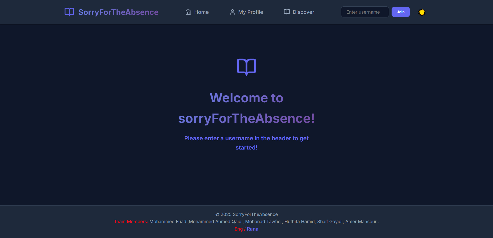
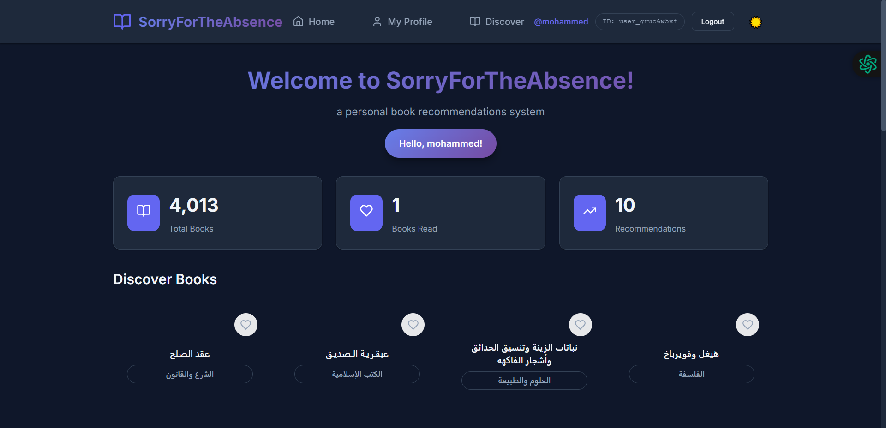
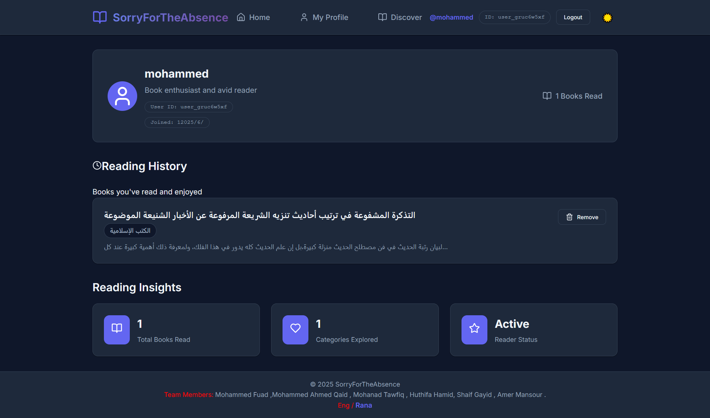

# SorryForTheAbsence - Book Recommendation System

"SorryForTheAbsence" is a book recommendation system designed to suggest Arabic books and articles. It leverages content-based similarity from text embeddings and incorporates user reading history for personalized suggestions. The frontend is built with React and the backend with FastAPI.

**Team Members**:
- Mohammed Fuad

- Mohammed Ahmed Qaid

- Mohanad Tawfiq

- Huthifa Hamid

- Shaif Gayid

- Amer Mansour

**Instructor**: *Eng. Rana*


### Home Page Before Registering


### Home Page After Registering


### Profile Page



##  Data Generation
The recommendation engine relies on semantic embeddings of book descriptions. These embeddings, along with a precomputed similarity matrix and other essential data artifacts, are generated by a separate process, detailed in the booksRecomendations.ipynb notebook .

## Key steps in booksRecomendations.ipynb include:
1. Loading the raw Arabic book dataset (e.g., jamalon7.csv).
2. Extensive text preprocessing using the ArabicTextPreprocessor class (Unicode normalization, Arabic character normalization, numeral standardization, removal of diacritics, punctuation, emojis).
3. Generating book description embeddings using a pre-trained transformer model (we used CAMeLBERT model becuase it's the best model for Arabic text classification  ).
4. Calculating a pairwise cosine similarity matrix from these embeddings.
5. Saving the crucial outputs (book metadata, the similarity matrix, title-to-index mappings) into the data/ directory, to use them in this FastAPI .


## Features

- 🔐 **User Management**: Unique user IDs with username-based registration
- 📚 **Book Discovery**: Search books by title and category
- 🎯 **Smart Recommendations**: 
  - Item-to-item recommendations using similarity matrix
  - User-based recommendations from reading history
  - Category-based recommendations
  - Hybrid recommendation approach
- 📊 **Reading History**: Track and manage books you've read
- 🌙 **Dark/Light Theme**: Toggle between themes
- 📱 **Responsive Design**: Works on desktop and mobile

## Project Structure

```
Books Recommendation/
├── frontend/                 # React frontend
│   ├── src/
│   │   ├── components/    
│   │   ├── App.jsx         
│   │   └── App.css         
│   └── package.json
├── backend/                 # FastAPI backend
│   ├── main.py             # Main run file
│   ├── data_loader.py      # Data loading utilities
│   ├── user_manager.py     # User management with CSV
│   ├── recommendation_engine.py # Recommendation logic
│   ├── models.py           # Pydantic models
│   └── requirements.txt
├── data/                   # Data artifacts
│   ├── book_metadata.csv   # Book information
│   ├── similarity_matrix.npy # Precomputed similarities
│   ├── title_to_index.pkl  # Title mappings
│   ├── index_to_title.pkl  # Index mappings
│   ├── users.csv          # simple User data file
│   └── user_history.csv   # Reading history
└── README.md
```

## Quick Start

### 1. Start the Backend

```bash
# Navigate to backend directory
cd backend

# Install dependencies
pip install -r requirements.txt

# Start the server
python main.py
```

### 2. Start the Frontend

```bash
# Navigate to frontend directory
cd frontend

# Install dependencies
npm install

# Start the development server
npm run dev
```

Usually the frontend will be available at `http://localhost:5173`

## API Endpoints

### User Management
- `POST /users` - Create a new user
- `GET /users/{user_id}` - Get user information
- `GET /users/{user_id}/stats` - Get user statistics ...


### System
- `GET /` - Health check and stats
- `GET /stats` - System statistics

### User Data (CSV)
- **users.csv**: Stores user information (id, username, created_at)
- **user_history.csv**: Stores reading history (user_id, book_id, timestamp)

### Book Data
- Uses your existing precomputed data artifacts
- Loads similarity matrix and metadata on startup

## Usage

1. **Register**: Enter a username to get a unique user ID
2. **Discover**: Search for books by title or browse categories
3. **Read**: Add books to your reading history by (only clicking the book card to see only a modal for book description -> just simulation)
4. **Get Recommendations**: View personalized suggestions based on your history
5. **Explore**: Find similar books using item-to-item recommendations


### Frontend
- **React 18** with Vite
- **React Router** for navigation
- **Lucide React** for icons
- **Axios** for API calls
- **CSS3** with custom properties for theming

### Backend
- **FastAPI** for REST API
- **Pandas** for data manipulation
- **NumPy** for similarity calculations
- **Pydantic** for data validation
- **Uvicorn** as ASGI server


# Notes 

- ### Generate Data Artifacts
Ensure you have necessary files in the data/ directory *or* run the booksRecomendations.ipynb to generate the necessary files in the data/ directory ( book_metadata.csv, similarity_matrix.npy, etc. we mentioned before) . This step is crucial as the backend relies on these precomputed artifacts. **or /** you can download them from these link:

https://drive.google.com/drive/folders/1RV591D1SOqWxLsqWpmhtzd_dETfoVOLW?usp=sharing
- ### the dataset we used is not good and contains

